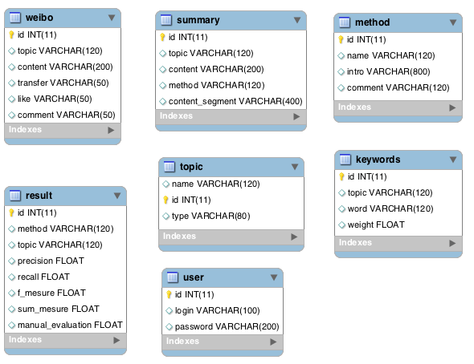

# README
## 新浪微博自动文摘系统

**完善中......**

给定微博话题数据集，从中筛选出前N（N>0)条微博，作为话题摘要。

问题实质：短文本多文档自动文摘。

流程：数据-算法-评估-展现

1.  数据获取与预处理：如何通过编写爬虫获取网站数据？
2. 摘要算法：如何使用Python及其相关工具集实现算法？（阅读论文和资料理解算法，理解公式含义，将公式转化为实际代码，也有很多算法在Python中已经实现，可以直接使用）
3. 摘要评估：如何对不同算法的结果进行评估？（ROUGE评估方式，中文评估注意点）
4. 系统展现：如何实现前端展现和后台管理的系统？（Flask、Flask-Admin；Bootstrap、E-Charts）如何部署系统到服务器？

### 技术方案概览：

## 使用
macOS Sierra 10.2.5

### 环境配置
建议在虚拟环境中运行, 若已安装pip:

	sudo pip install virtualenv
	virtualenv virtualEnv

进入虚拟环境：

	cd virtualEnv/
	source bin/activate

- Python 2.7
- Flask
- Flask 插件

### 运行

	cd virtualEnv/
	source bin/activate
	cd weiboApplication

指定变量：

	export FLASK_APP = app.py
调试模式（可选）：

	export FLASK_DEBUG=1
运行：
	
	flask run

默认访问：
	
	* Serving Flask app "weibo-summary.weiboApplication.app"
	* Running on http://127.0.0.1:5000/ (Press CTRL+C to quit)
## 项目目录结构
<!--find . -print | sed -e 's;[^/]*/;|____;g;s;____|; |;g'-->

	|____app.py（应用入口）
	|____config.py
	|____manage.py
	|____requirement.txt（需安装的依赖）
	|____weiboModel.py
	|____weibo-summary.wsgi（部署配置）
	|____Algorithms（算法）
	| |____Hybird-TFIDF.py
	| |____TextRank.py
	| |____TFIDF.py
	| |____utilities.py
	| |...
	|____Data (数据)
	| |____rawData（原始数据）
	| |____weiboData（预处理后数据）
	| |____ResultData（生成摘要结果数据）
	| |____ROUGE（算法评估结果数据）
	|____db（数据库）
	|____lib（使用的第三方库）
	|____static
	| |____css
	| |____echarts（图表插件）
	| |____font-awesome
	| |____js
	| |...
	|____templates
	| |____admin（后台）
	| |____slide（模板分割模块）
	|____util（自动化与处理脚本）

## 摘要算法

- Baseline
	- MostRecent
	- Random
- TextRank 
- TF-IDF
- Hybrid TF-IDF

## ROUGE评估

## 系统
### 需求分析

### 架构设计

### 功能模块设计

### 数据库
本系统数据库为MySQL

### 前端
#### 前台展现
#### 后台管理
### 后台

## TODO
- [ ] 封装类
- [ ] 抽离app.py

## References:
- [PR alg/TF-IDF](http://www.cs.uccs.edu/~jkalita/papers/2010/SharifiBeauxSocialcom2010.pdf)  
- [PageRank and Summary Survey](http://www.aclweb.org/anthology/W/W13/W13-11.pdf#page=30)

